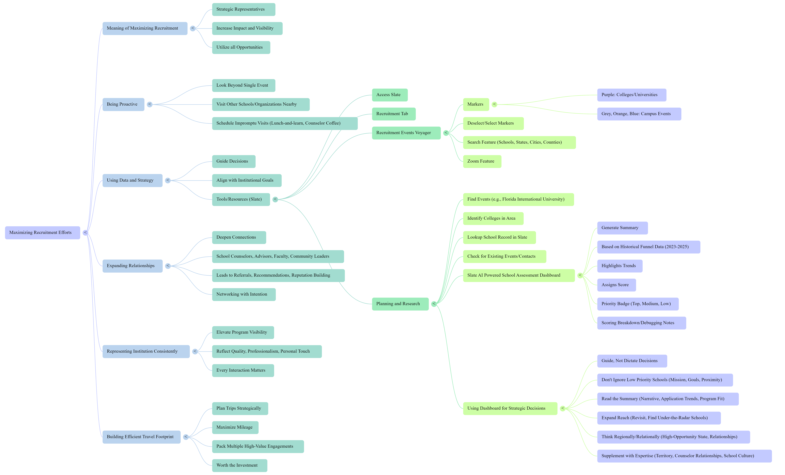

### 📂 AI-Powered Training & Onboarding System

### Overview
This project summarizes a set of internal tools and resources I designed to improve training and strategic planning using AI, web technologies, and lightweight automation.

## 🧠 Visual Overview

This mind map shows how all parts of the recruitment planning system are connected, including AI tools, resources, and documentation.

---
### 🛠️ Tools Used

- OpenAI (GPT-4, prompt engineering)

- Slate CRM (bot integration)

- NotebookLM (Google AI assistant)

- Google Vids + Canva (video production)

- HTML, GitHub Pages (interactive documentation)

- Google Sites (resource organization)
---
### 📚 Project Components
| Component            | Description |
|---------------------|-------------|
| Recruitie (AI Bot)  | Internal CRM-integrated AI assistant that helps recruiters build data-informed recruitment plans through prompt-based interactions. |
| NotebookLM Training | Structured AI notebooks that guide staff through interconnected planning concepts. |
| Training Videos     | Short walkthroughs using Google Vids to onboard new users and support just-in-time learning. |
| GitHub Pages Site   | HTML-based instructional hub with modular guidance for recruitment-related tasks. |
| Google Sites Portal | Centralized hub for all recruitment plans and tools (internal-only). |
---
### 🎯 Skills Demonstrated

- Strategic training system design

- Prompt engineering & AI tool building

- Data-driven planning workflows

- Cross-functional documentation

- Scalable enablement tools
---
